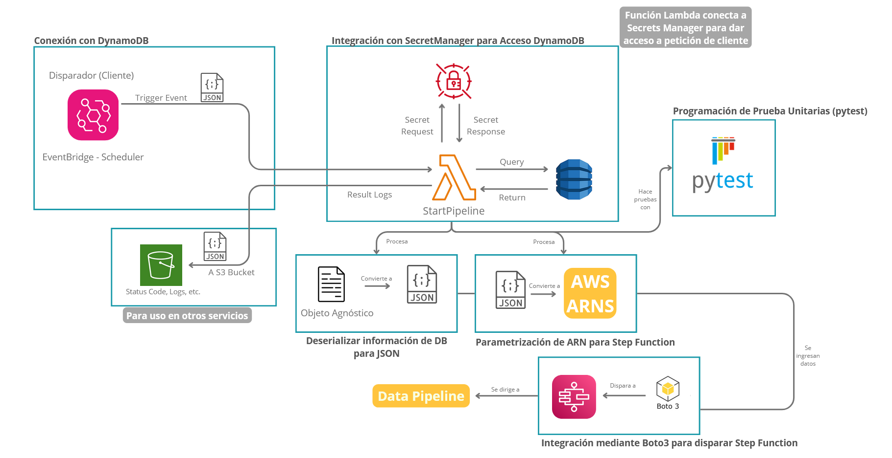

# Resumen

Este módulo se encarga de iniciar y dar los preparativos al sistema ETL

## Inicializar Step Functions

Para inicializar python se pueden utilizar las librerías mencionadas en este módulo.

```Python title="start-pipeline.py"

def lambda_handler(event, context):
    load_dotenv()

    arn = getenv("ARN_STEP_FUNCTION")
    secret_name = getenv("AWS_SECRET")

    secret_connector = SecretConnector(secret_name)

    dynamo_connector = DynamoConnector(
        secret_connector.get_access_key(),
        secret_connector.get_secret_key(),
        secret_connector.get_region(),
    )

    table_name = "subdomains"
    pk_name = "name_id"

    entity = context["entity_to_execute"]

    payload = dynamo_connector.get_item_to_json(table_name, entity, pk_name)

    step_connector = StepConnector(arn, payload)

    print(step_connector.get_start_date())

```

Los módulos utilizados para este proceso son:

<ol>
<li>Conector a SecretsManager</li>
<li>Conector a DynamoDB</li>
<li>Conector a StepFunctions</li>
</ol>

Obtenemos la información necesaria para conectarse a la base de datos de DynamoDB desde SecretsManager para finalmente iniciar el sistema del StepFunction utilizando una ARN dada.


